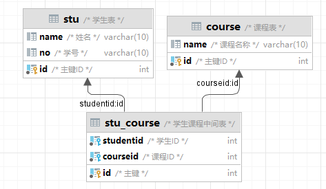
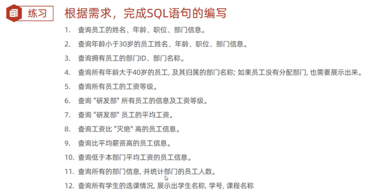
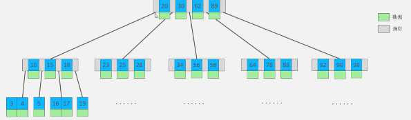
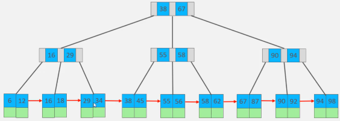
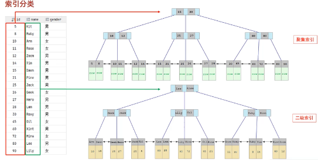
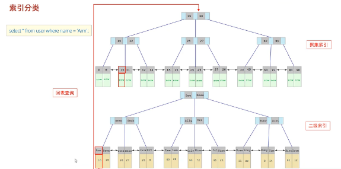
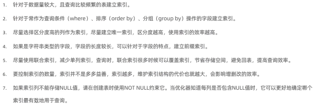

## MySQL-基础篇


#### 基础篇-DML

1. INSERT
2. UPDATE
3. DELETE

---

1> INSERT 插入 1条 & 多条

```mysql
insert into 表名 (字段1,...)
values (值1,...),(值1,...);
```

2> update 更新

```mysql
update 表面
set 字段1 = 值1 ...	# 1个&多个
where 字段 = 值;		# where条件	不加where 更新整张表
```

3> delete 删除

```mysql
delete
from 表名
where id = 3;		  # 不加where 删除所有
```

> 总结

1. inster 可以插入多行数据，使用	‘，‘	分割，需要注意字段和值的对应；
2. update修改多个值，使用 ， 分割，注意：不加where条件更新所有；
3. delete 如果没有 where条件是危险的！


#### 基础篇-DQL

测试表：

```mysql
create table emp(
    id int comment '编号',
    workno varchar(10) comment '工号',
    name varchar(10) comment '姓名',
    gender char(1) comment '性别',
    age tinyint unsigned comment '年龄',
    idcard char(18) comment '身份证号',
    workaddress varchar(50) comment '工作地址',
    entrydate date comment '入职时间'
)comment '员工表';

insert into emp (id, workno, name, gender, age, idcard, workaddress, entrydate)
values (1, '00001', '柳岩666', '女', 20, '123456789012345678', '北京', '2000-01-01'),
        (2, '00002', '张无忌', '男', 18, '123456789012345670', '北京', '2005-09-01'),
        (3, '00003', '韦一笑', '男', 38, '123456789712345670', '上海', '2005-08-01'),
        (4, '00004', '赵敏', '女', 18, '123456757123845670', '北京', '2009-12-01'),
        (5, '00005', '小昭', '女', 16, '123456769012345678', '上海', '2007-07-01'),
        (6, '00006', '杨逍', '男', 28, '12345678931234567X', '北京', '2006-01-01'),
        (7, '00007', '范瑶', '男', 40, '123456789212345670', '北京', '2005-05-01'),
        (8, '00008', '黛绮丝', '女', 38, '123456157123645670', '天津', '2015-05-01'),
        (9, '00009', '范凉凉', '女', 45, '123156789012345678', '北京', '2010-04-01'),
        (10, '00010', '陈友谅', '男', 53, '123456789012345670', '上海', '2011-01-01'),
        (11, '00011', '张士诚', '男', 55, '123567897123465670', '江苏', '2015-05-01'),
        (12, '00012', '常遇春', '男', 32, '123446757152345670', '北京', '2004-02-01'),
        (13, '00013', '张三丰', '男', 88, '123656789012345678', '江苏', '2020-11-01'),
        (14, '00014', '灭绝', '女', 65, '123456719012345670', '西安', '2019-05-01'),
        (15, '00015', '胡青牛', '男', 70, '12345674971234567X', '西安', '2018-04-01'),
        (16, '00016', '周芷若', '女', 18, null, '北京', '2012-06-01') ;
select * from emp;
```


查询数据

```MYSQL
select
	字段列表
from
	条件列表
where
	条件列表
group by
	分组字段列表
having
	分组后条件列表
order by
	排序字段列表
linit
	分页参数
```

+ 基本查询
+ 条件查询（where）
+ 聚合函数（count、max、min、avg、sum）
+ 分组查询（group by）
+ 排序查询（order by）
+ 分页查询（limit）

##### :deciduous_tree: DQL-基本查询

```MYSQL
select *
from 表名;
```

设置别名

```MYSQL
SELECT 字段1[as 别名1] ... from 表名;
```

去除重复记录

```MYSQL
select distinct 表面 from 字段;
```

##### :deciduous_tree: DQL-条件查询

语法

```MYSQL
SELECT 字段列表 FRM 表名 WHERE 条件列表
```

| 比较运算符     | 功能                                 |
| -------------- | ------------------------------------ |
| > >= < <= = != | 大于...                              |
| between ...and | 在某个范围内，含最大最小值           |
| in(...)        | 在 in中的列表中多选一                |
| like 占位符    | 模糊匹配 下划线单个字符，%任意个字符 |
| is null        | 是NULL                               |

| 逻辑运算符 | 功能 |
| ---------- | ---- |
| AND 或 &&  | 并且 |
| OR 或 \|\| | 或者 |
| NOT 或 ！  | 非   |

##### :deciduous_tree: DQL-聚合函数

将一列数据作为一个整体，进行纵向计算。

常见聚合函数

| 函数  | 功能     |
| ----- | -------- |
| count | 统计数量 |
| max   | 最大值   |
| min   | 最小值   |
| avg   | 平均值   |
| sum   | 求和     |

示例：

```MYSQL
select count(age) from emp;
select max(age) from emp;
select min(age) from emp;
select sum(age) from emp;
select avg(age) from emp;
```

注意：所有NULL不参与聚合运算；


##### :deciduous_tree:DQL-分组查询

语法

```MYSQL
SELECT 字段列表 from 表名 [where 条件] group by 分组字段名 [having 分组后过滤条件];
```

+ where 不能对聚合函数判断，having可以

示例

```mysql
# 男女数量
select gender,count(*) from emp group by gender ;
# 男女平均值
select gender,avg(age) from emp group by gender ;

# 根据地址分组，age<45 的查询数量
select workaddress,count(*) from emp where age < 45 group by workaddress ;
# >=3
select workaddress,count(*) from emp where age < 45 group by workaddress having count(*) >=3;
```

注意：

+ 执行顺序：where 、聚合函数、 having
+ 分组后查询的一般为聚合函数和分组字段，查询其他的字段没有任何意义

##### :deciduous_tree:DQL-排序查询

order by

语法

```MYSQL
select 字段列表 from 表名 order by 字段1,排序方式1,字段2,排序方法2;
```

排序方式

+ ASC：升序（默认）
+ DESC：降序

注意多字段排序：如果第一个值相同，排序第二个值...

示例：

```MYSQL
select * from emp order by age ;
select * from emp order by age,entrydate;
select * from emp order by age desc ;
select * from emp order by age asc ,entrydate desc ;
```


##### :deciduous_tree:DQL-分页查询

语法：

```MYSQL
SELECT 字段列表 FROM 表名 limit 起始索引,查询记录数;
```

注意：

+ 起始索引0，=（查询页码-1）*每页显示记录数。
+ 查询的是第一页，起始索引可以省略，直接写成 limit 10

示例：

```sql
# 分页查询
select * from emp limit 10;
```


##### :deciduous_tree:DQL-案例

```mysql
# 查询年龄为 21，22，23，24 的女性员工信息
SELECT * FROM emp WHERE age IN (20,21,22,23) and;
# 查询男，并且年龄20-40，名字三个字
SELECT * FROM emp WHERE gender = '男' and age between 20 and 40 and emp.name like '___';
# 统计男女数量
select gender,count(*) from emp group by gender;
# 查询年龄<=35,并且按照age升序，age相同入职时间降序 的员工name和age
select name,age,entrydate from emp where age <= 35 order by age,entrydate desc ;
# 男、age 10-40、age,入职时间降序，分页5
select * from emp where gender = '男' and age between 10 and 40 order by age asc ,entrydate limit 5;
```


##### :deciduous_tree:DQL-执行顺序

1> 编写顺序

```mysql
select
	字段列表
from
	条件列表
where
	条件列表
group by
	分组字段列表
having
	分组后条件列表
order by
	排序字段列表
linit
	分页参数
```

执行 顺序：

```
from
where
group by
having
select
oreder by
limit
```

验证：

```mysql
# 设置别名
select e.name,e.age from emp e where e.age > 15  order by age ;
```


##### :deciduous_tree:DQL - 小结

```sql
select
	字段列表	---- > 字段名[AS]别名
from
	表名
where
	条件列表 【>=<= ! link and or between...and in() is null】
group by
	分组字段列表
having
	分组后的条件列表
order by
	排序字段列表	【asc升序、desc降序；多个字段排序】
limit
	分页参数	【起始索引 0,每页的记录数】
```


#### 基础篇-DCL

介绍：DCL 数据控制语言、用来管理数据库用户、控制数据库的访问权限。


##### :deciduous_tree:DCL-用户管理

mysq中的user表；

1> 查询用户

```MYSQL
USE MYSQL;
select * from user;
```

2> 创建用户

```mysql
create user '用户名'@'主机名' identified by '密码';

create user 'test'@'localhost' identified by 'test@123';
# 创建test2可以在任意主机访问
create user 'test2'@'%' identified by 'test2@123';
```

3> 修改用户密码

```SQL
alter user 'test2'@'%' identified with mysql_native_password by '1234';
```

4> 删除用户

```mysql
drop user test2;
```

注意：

1. 主机名可以使用 % 通配符
2. 这类SQL主要是DBA（数据库管理员）使用。


##### :deciduous_tree:DCL-权限控制（了解）

所有权限：ALL

也有：SELECT、INSERT、UPDATE、DELETE、ALTER、DROP、CREATE

1> 查询权限

```mysql
show grants for 'test'@'localhost';
```

2> 授予权限

```MYSQL
grant 权限列表 on 数据库.表名 to ’user@主机名‘;
```

3> 撤销权限

```MYSQL
remove 权限列表 on 数据库.表名 FROM ’user@主机名‘;
```


#### 基础篇-函数

---

函数：一段直接调用的代码或程序；

+ 字符串函数
+ 数值函数
+ 日期函数
+ 流程函数


##### :deciduous_tree:字符串函数

常用的：

| 函数                     | 功能                                            |
| ------------------------ | ----------------------------------------------- |
| concat(s1,s2,sn)         | 字符串拼接                                      |
| lower(str)               | 字符串转为小写                                  |
| upper(str)               | 字符串转为大写                                  |
| lpad(str,n,pad)          | 左填充，用字符串pad对str左填充达到n个字符串长度 |
| rpad(str,n,pad)          | 右填充，用字符串pad对str右填充达到n个字符串长度 |
| trim(str)                | 去掉字符串头尾空格                              |
| substring(str,start,len) | 返回字符串str冲start位置起的len个长度的字符串   |

示例：

```mysql
# concat
select concat('hello','mysql');
# lower
select lower('HELLO');
# upper
select upper('hello');
# load
select lpad('01',5,'-');
# rpad
select rpad('01','5','-');
# trim
select trim('  hello  ');
# 切片
select substring('Hello Mysql',1,5);
# 案例：工号不足8位数的前面全部补0
select *
from emp;

update emp set workno = lpad(workno,8,'0');
select name,workno from emp;
```


##### :deciduous_tree:数值函数

常见的数值函数：

| 函数       |                            |
| ---------- | -------------------------- |
| ceil(x)    | 向上取整                   |
| floor(x)   | 向下取整                   |
| mod(x,y)   | 返回x/y的模                |
| rand()     | 返回0-1内随机数            |
| round(x,y) | 求x的四舍五入，保留y位小数 |

示例：

```mysql
select ceil(1.1);
select floor(1.1);
select mod(3,4);
select rand();
select round(2.123456,5);

# 生成一个随机的六位数密码
select lpad(round(rand()*1000000,0),6,0);
```


##### :deciduous_tree:日期函数

日期函数

常见的日期函数如下：

| 函数       |                          |
| ---------- | ------------------------ |
| curdate( ) | 当前日期                 |
| curtime    | 时间                     |
| now        | 日期+时间                |
| year       | 年                       |
| month      | 月                       |
| day        | 日                       |
| date_add   | 日期上加一个时间间隔     |
| datediff   | 起始日期和结束日期的间隔 |

示例：

```MYSQL
select now();
select curdate() ;
select curtime();
select year(now());
select date_add(now(),interval 70 day );
select datediff(curdate(),'2024-2-26')

#查询所有员工的入职天数;
select name,datediff(entrydate,curdate()) e from emp order by e desc ;
```


##### :deciduous_tree:流程函数

用于：在SQL语句实现条件筛选，从而提高语句效率。

| 函数                                                     | 功能                                          |
| -------------------------------------------------------- | --------------------------------------------- |
| if（value，t，f）                                        | 如果value为空，返回t，否则f                   |
| ifunll( value1,value2)                                   | value 不为空，返回value1，否则value2          |
| case when [vall] then [res1] ...else[default] end        | value为true，返回res1，否则返回default默认值  |
| case [expr] when [vall] then [res1] ...else[default] end | expr = value，返回res1，否则返回default默认值 |


示例：

```MYSQL
select if(true,'ok','error');
select ifnull(null,'Default');
```


:deciduous_tree:小结

1. 字符串函数：concat、lower、upper、lpad、trim、substring
2. 数值函数：ceil、floor、mod、rand、round
3. 日期函数：curdate、curtime、year、day、month、date_add、dateiff
4. 流程函数：if、ifnull case


#### 基础篇-约束

---

限制表结构中存储的数据

+ 概述
+ 约束演示
+ 外键约束

##### :deciduous_tree:概述

1. 约束时作用在表中字段上的规则，用户限制存储在表中的数据。
2. 目的：保证数据的正确性、有效性和完整性。
3. 分类：

| 约束 | 描述                                                     | 关键字         |
| ---- | -------------------------------------------------------- | -------------- |
| 非空 | 限制字段数据不能是null                                   | not null       |
| 唯一 | 保证该字段的所有数据都是唯一的，不重复                   | unique         |
| 主键 | 主键是一行数据的唯一标识，要求非空且唯一                 | primary key    |
| 默认 | 保存数据时，如果未指定该字段的值，则采用默认值           | default        |
| 检查 | 保证字段的值满足某一个条件                               | check          |
| 外键 | 用来让两张表的数据之间建立连接，保证数据的一致性和完整性 | foreign key    |
| 自增 | 常用于主键                                               | auto_increment |


```mysql
desc table student;
select * from student;
show create table student;
delete from student where id in(1,2);
insert into student (id, name, age,status,gender)
values (1,'王子',18,1,'男'),
       (2,'公主',120,0,'女')
       ;
select * from student;
insert into student (name)
values ('士兵1');
```


##### :deciduous_tree:外键约束

概念

+ 两张表建立连接，从而保证数据的一致性和完整性

主表、子表

```MYSQL

-- 准备数据
create table dept
(
    id   int auto_increment comment 'ID' primary key,
    name varchar(50) not null comment '部门名称'
) comment '部门表';
 
create table emp
(
    id          int auto_increment comment 'ID' primary key,
    name        varchar(50) not null comment '姓名',
    age         int comment '年龄',
    job         varchar(20) comment '职位',
    salary      int comment '薪资',
    entrydate   date comment '入职时间',
    managerid   int comment '直属领导ID',
    dept_id     int comment '部门ID',
    workaddress int         not null
) comment '员工表';

INSERT INTO emp (id, name, age, job, salary, entrydate, managerid, dept_id)
VALUES (1, '金庸', 66, '总裁', 20000, '2000-01-01', null, 5),
 
       (2, '张无忌', 20, '项目经理', 12500, '2005-12-05', 1, 1),
       (3, '杨逍', 33, '开发', 8400, '2000-11-03', 2, 1),
       (4, '韦一笑', 48, '开发', 11000, '2002-02-05', 2, 1),
       (5, '常遇春', 43, '开发', 10500, '2004-09-07', 3, 1),
       (6, '小昭', 19, '程序员鼓励师', 6600, '2004-10-12', 2, 1),
 
       (7, '灭绝', 60, '财务总监', 8500, '2002-09-12', 1, 3),
       (8, '周芷若', 19, '会计', 48000, '2006-06-02', 7, 3),
       (9, '丁敏君', 23, '出纳', 5250, '2009-05-13', 7, 3),
 
       (10, '赵敏', 20, '市场部总监', 12500, '2004-10-12', 1, 2),
       (11, '鹿杖客', 56, '职员', 3750, '2006-10-03', 10, 2),
       (12, '鹤笔翁', 19, '职员', 3750, '2007-05-09', 10, 2),
       (13, '方东白', 19, '职员', 5500, '2009-02-12', 10, 2),
 
       (14, '张三丰', 88, '销售总监', 14000, '2004-10-12', 1, 4),
       (15, '俞莲舟', 38, '销售', 4600, '2004-10-12', 14, 4),
       (16, '宋远桥', 40, '销售', 4600, '2004-10-12', 14, 4),
       (17, '陈友谅', 42, null, 2000, '2011-10-12', 1, null);
    

INSERT INTO dept (id, name)
VALUES (1, '研发部'),
       (2, '市场部'),
       (3, '财务部'),
       (4, '销售部'),
       (5, '总经办'),
       (6, '人事部');
```

1> 创建主键

1. 创建表时直接添加
2. 创建表后添加

语法：

```MYSQL
alter table 表名 add constraint 外键名称 foreign key(外键字段) references 主表(主表列名);

alter table emp2 add constraint fk_emp_dept_id foreign key(dept_id) references dept(id);
```

创建外键后删除子表信息可能会报错

2> 删除外键

```mysql
alter table emp2 drop foreign key fk_emp_dept;
```


删除更新行为

| 行为        |                                                              |
| ----------- | ------------------------------------------------------------ |
| no action   | 在父表删除更新时，先检查是否有外键，如果有不允许             |
| restrict    | 在父表删除更新时，先检查是否有外键，如果有不允许             |
| cascade     | 在父表删除更新时，先检查是否有外键，如果有也删除子表中的记录 |
| set null    | 在父表删除时，先检查是否有外键，如果有则设置表中该外键值为null |
| set default | 父表有变量更新时，子表将外键列设置成一个默认的值             |

只需在外键后加

```MYSQL
alter table 表名 add constraint 外键名称 foreign key(外键字段) references 主表(主表列名) n UPDATE cascade  on delete cascade ;


alter table emp2 add constraint fk_emp_dept foreign key(dept_id) references dept(id) on UPDATE cascade  on delete cascade ;

```


##### :deciduous_tree:小结

1. 非空约束 not null
2. 唯一约束 unique
3. 主键约束：primary key (自增：auto_incrment)
4. 默认约束 default
5. 检查约束：delete
6. 外键约束：foreign key


#### 基础-多表查询

---

+ 多表关系
+ 多表查询概述
+ 内连接
+ 外连接
+ 自连接
+ 子查询
+ 多表查询案例

##### :deciduous_tree:多表关系

+ 项目业务直接关系错综复杂，表之间联系
  1. 一对多：典型案例：部门和员工
  2. 多对多：学生与课程，建立中间表（至少包含2个外键，分别关联两方主键）
  3. 一对一:  用户与用户详情，多用于多表拆分，外键id加上 unique唯一约束

多对多：

```MYSQL

create table stu
(
    id   int auto_increment primary key comment '主键ID',
    name varchar(10) comment '姓名',
    no   varchar(10) comment '学号'
) comment '学生表';
insert into stu
values (null, '黛绮丝', '2000100101'),
       (null, '谢逊', '2000100102'),
       (null, '殷天正', '2000100103'),
       (null, '韦一笑', '2000100104');
 
 
create table course
(
    id   int auto_increment primary key comment '主键ID',
    name varchar(10) comment '课程名称'
) comment '课程表';

insert into course
values (null, 'Java'),
       (null, 'PHP'),
       (null, 'MySQL'),
       (null, 'Hadoop');
 
 
create table course
(
    id        int auto_increment comment '主键' primary key,
    studentid int not null comment '学生ID',
    courseid  int not null comment '课程ID',
    constraint fk_courseid foreign key (courseid) references course (id),
    constraint fk_studentid foreign key (studentid) references stu (id)
) comment '学生课程中间表';
 
insert into stu_course
values (null, 1, 1),
       (null, 1, 2),
       (null, 1, 3),
       (null, 2, 2),
       (null, 2, 3),
       (null, 3, 4);
```

 


##### :deciduous_tree:多表查询

从多张表查询数据

```MYSQL
# 笛卡尔积
select * from emp,dept;
# 多表查询
select * from dept,emp where emp.dept_id = dept.id;
```

多表查询分类

+ 连接查询
  + 内连接：相当于查询AB的交集
  + 外连接
    + 左：查询左边所有数据，以及两张表的交集
    + 右：同上
  + 自连接：当前表与自身的连接查询，必须使用表名
+ 子查询


##### :deciduous_tree:内连接

内连接查询语法：

1. 隐式	select * from 表1,表2 where ...
2. 显式    select * from 表1 [inner] join 表2 on 连接条件...

```mysql
# 内连接
# 查询员工name和所在部门
select emp.name,dept.name from emp,dept where emp.dept_id = dept.id;

select e.name,d.name from emp e,dept d  where e.dept_id = d.id;

# 显示内连接
select e.name,d.name from emp e inner join dept d on e.dept_id = d.id
```


##### :deciduous_tree:外连接

+ 左外 select * from 表1 left [outer] join 表2 条件...
  + 表1以及表2的交集
+ 右外 select * from 表1 right [outer] join 表2 条件...

```MYSQL
# 左外
# emp所有 以及不能信息
select e.*,d.name from emp e left join dept d on d.id = e.dept_id;

# 右外
select d.*,e.* from emp e right join dept d on d.id = e.dept_id;
```


##### :deciduous_tree: 自连接

自连接查询，可以是内连接查询，也可以是外连接查询；

语法

```mysql
SELECT * from 表1 join 表2 on 条件

# 自连接 - 内 -交集
select a.name,b.name from emp a,emp b where a.managerid = b.id;

# 自连接 - 外
select a.name,e.name from emp a left join emp e on a.managerid = e.managerid;
```


##### :deciduous_tree:联合查询

+ union，union all

就是把多次查询出来的结果合并起来，形成一个新的查询结果集；

```MYSQL
SELECT * from 表A ...
union[all]
SELECT * from 表B ...
```

示例：

```MYSQL
# 需求，薪资低于5000 和 年龄大于50
select name from emp where salary <5000
union all
select name from emp where age > 50 ;
# 注意，有一个员工重复出现两次，因为两个条件都符合，去重 删除all

select name from emp where salary < 5000 or age > 50;
```

注意：字段数量以及类型相同（上下两条select）


##### :deciduous_tree:子查询

概念：SQL语句中的嵌套select语句，称为且套语句，又称子查询

```SQL
SELECT * from t1 where columnl = (select columnt from t2);
```

子查询外部语句可以是insert update delete select 的任何一个

根据子查询结果，分为

+ 标量子查询
+ 列子查询
+ 行子查询
+ 表子查询

**1> 标量子查询**

+ 返回结果是单个值（数组、字符串、日期等），最简单的形式；

```mysql
# 查询 “销售部所有员工信息”
# --- a.销售部部门id
select id from dept where name = '销售部';
# ---b.根据一id查询信息
select * from emp where dept_id = 4;

#  一条sql查询 （子查询）
select * from emp where dept_id = (select id from dept where name = '销售部');
```

**2> 列子查询**

返回结果是一列（可以是多行）

+ in、not in、any、some、all

```mysql
# 比财务部所有人工资都高的员工
# 1.财务部所有人工资、2.比高的人
select id from dept where  name='财务部';
select salary from emp where dept_id='3'
select salary from emp where dept_id=(select id from dept where  name='财务部');
select * from emp where salary > all (select salary from emp where dept_id=(select id from dept where  name='财务部'));

# 比财务部所有人工资都高的员工
# 1.财务部所有人工资、2.比高的人
select id from dept where  name='财务部';
select salary from emp where dept_id='3';
select salary from emp where dept_id=(select id from dept where  name='财务部');
select * from emp where salary > all (select salary from emp where dept_id=(select id from dept where  name='财务部'));


# 比研发部其中任意一个人工资高的员工信息
select salary from emp where dept_id=(select id from dept where  name='研发部');
select * from emp where salary > any (select salary from emp where dept_id=(select id from dept where  name='财务部'));
```

**3>行子查询**

返回的是一行或多行

+ =、<>、in、not in；

```mysql
# 查询和张无忌薪资相同及直属领导的薪资
# 张无忌
select salary,managerid from emp where name='张无忌' ;
select name,salary from emp where (salary,managerid) = (12500,1);
select name,salary from emp where (salary,managerid) = (select salary,managerid from emp where name='张无忌' ) ;
```

**4>表子查询**

多行多列

常用操作符：in

```mysql
# 职位薪资相同的人 鹿杖客 宋远桥
select job,salary from emp where name in('鹿杖客','宋远桥');
select * from emp where (job,salary) in (select job,salary from emp where name in('鹿杖客','宋远桥'));

# 入职2006-1-1之后的员工，及其部门信息
select  * from emp where entrydate > '2006-01-01';
select * from (select  * from emp where entrydate > '2006-01-01') e left join dept d on e.dept_id=d.id;
```


##### :deciduous_tree:练习1

创建表：

```MYSQL

-- 准备数据
create table dept
(
    id   int auto_increment comment 'ID' primary key,
    name varchar(50) not null comment '部门名称'
) comment '部门表';
 
create table emp
(
    id          int auto_increment comment 'ID' primary key,
    name        varchar(50) not null comment '姓名',
    age         int comment '年龄',
    job         varchar(20) comment '职位',
    salary      int comment '薪资',
    entrydate   date comment '入职时间',
    managerid   int comment '直属领导ID',
    dept_id     int comment '部门ID',
    workaddress int         not null
) comment '员工表';

INSERT INTO emp (id, name, age, job, salary, entrydate, managerid, dept_id)
VALUES (1, '金庸', 66, '总裁', 20000, '2000-01-01', null, 5),
 
       (2, '张无忌', 20, '项目经理', 12500, '2005-12-05', 1, 1),
       (3, '杨逍', 33, '开发', 8400, '2000-11-03', 2, 1),
       (4, '韦一笑', 48, '开发', 11000, '2002-02-05', 2, 1),
       (5, '常遇春', 43, '开发', 10500, '2004-09-07', 3, 1),
       (6, '小昭', 19, '程序员鼓励师', 6600, '2004-10-12', 2, 1),
 
       (7, '灭绝', 60, '财务总监', 8500, '2002-09-12', 1, 3),
       (8, '周芷若', 19, '会计', 48000, '2006-06-02', 7, 3),
       (9, '丁敏君', 23, '出纳', 5250, '2009-05-13', 7, 3),
 
       (10, '赵敏', 20, '市场部总监', 12500, '2004-10-12', 1, 2),
       (11, '鹿杖客', 56, '职员', 3750, '2006-10-03', 10, 2),
       (12, '鹤笔翁', 19, '职员', 3750, '2007-05-09', 10, 2),
       (13, '方东白', 19, '职员', 5500, '2009-02-12', 10, 2),
 
       (14, '张三丰', 88, '销售总监', 14000, '2004-10-12', 1, 4),
       (15, '俞莲舟', 38, '销售', 4600, '2004-10-12', 14, 4),
       (16, '宋远桥', 40, '销售', 4600, '2004-10-12', 14, 4),
       (17, '陈友谅', 42, null, 2000, '2011-10-12', 1, null);
    

INSERT INTO dept (id, name)
VALUES (1, '研发部'),
       (2, '市场部'),
       (3, '财务部'),
       (4, '销售部'),
       (5, '总经办'),
       (6, '人事部');
```

 

##### :deciduous_tree:小结

1. 多表关系：三种关系
   1. 一对多：多的一方设置外键，关联对方主键
   2. 多对多：建立中间表，至少两个外键
   3. 一对一：结构拆分，设置外键
2. 多表查询
   1. 内连接
      1. 隐式
      2. 显式 inner join 表 on 条件
   2. 外连接
      1. 左 left join
      2. 右 right join
   3. 自连接：对一张表查询多次，必须起别名
   4. 子查询：外层且套select查询


#### 基础篇-事务

---

事务：一组操作的组合，作为一个整体向操作系统提交或撤销请求；

+ 即要么同时成功要么同时失败
+ 异常回滚

事务操作

+ 查看设置事务提交方式

```MYSQL
SELECT @@autocommit;
set @autocommit=0;	#0 手动
```

+ 提交事务

```MYSQL
COMMIT
```


+ 回滚事务

```MYSQL
# --------------------------事务操作---------------------------
# 数据准备
create table account
(
    id int auto_increment primary key,
    name varchar(10),
    money int
);
insert into account (name, money)
values ('tom',2000),('alias',2000);

# 恢复数据
update account
set money = 2000
where name in('tom','alias');

SELECT @@autocommit;
set @@autocommit=0;
# 转账
# 1. 查询 tom 余额
select * from account where name='tom';
# 2. tom - 1000
update account
set money = money - 1000
where name='tom';
# 3. alias + 1000
update account
set money = money + 1000
where name='alias';
# 查询
select * from account;

# 提交
COMMIT;
```


##### :deciduous_tree: 事务四大特点

+ 原子性：最小操作单元，要么成要么败
+ 一致性：完成时所有数据状态一致
+ 隔离性：sql提供的隔离机制，保证事务不受外部并发操作的影响独立环境下运行
+ 持久性：事务一旦提交回滚，对数据中的数据改变时永久的


##### :deciduous_tree:并发事务问题

| 问题       | 描述                                                         |
| ---------- | ------------------------------------------------------------ |
| 脏读       | 一个事务督导另外一个事务还没有提交数据                       |
| 不可重复读 | 一个事物先后读同一条记录，但是两次读取数据不同，称为不可复读 |
| 幻读       | 一个事务按照条件查询数据时，没有对应的数据行，但是在插入时，又发现存在，出现了幻影 |


##### :deciduous_tree:事务隔离级别

解决并发事务引发的问题

事务隔离级别

| 隔离级别             | 脏读 | 不可重复读 | 幻读 |
| -------------------- | ---- | ---------- | ---- |
| read uncommitted     | y    | y          | y    |
| read committed       | x    | y          | y    |
| reoeatable read 默认 | x    | x          | y    |
| serializable         | x    | x          | x    |

```MYSQL
# 查看默认级别
select @@TRANSACTION_ISOLATIO87uN; 
```


##### :deciduous_tree: 事务小结

1. 事务简介
   + 事务时一组操作的集合，要么全部执行成功，要么全部执行失败
2. 事务操作
   + start transaction；开启事务
   + commit 、 rollback 提交和回滚
3. 事务四大特性
   1. 原子性
   2. 一致性
   3. 隔离性
   4. 持久性
4. 并发引发的问题
   + 脏读、不可重复读、幻读
5. 事务的隔离级别


#### 基础篇-总结

1. mysql概述
2. SQL：DDL、DQL、DML、DCL
3. 函数：字符串、日期、流程控制等
4. 约束：主键、非空、唯一、检查、默认、外键
5. 多表：一对一、一对多、多对多（各种查询的区别）
6. 事务


----


## MySQL-进价篇

+ 存储引擎
+ 索引（最核心）
+ SQL优化
+ 试图、存储过程、触发器
+ 锁
+ innoDB引擎
+ MySQL管理


#### 进价-存储引擎

+ MySQl体系结构
+ 存储引擎简介
+ 存储引擎特点
+ 存储选择器


##### :deciduous_tree:存储引擎

三层：

1. 连接层
2. 服务层
3. 引擎层
4. 存储层

默认存储引擎：ENGINE=InnoDB （默认）

查看当前支持的存储引擎：

```MYSQL
SHOW ENGINES ;
```

创建表，指定存储引擎

```MYSQL
create table my_myisam
(
    id int not null
)engine MyISAM; 
```

innoDB介绍：

+ 坚固可靠性和高性能

特点：

+ DML操作遵循ACID，支持事务
+ 行锁，提高并发访问性能
+ 支持外键，保障数据的完整性和正确性


#### 进价-索引（重要）

---

目录：

1. 概述
2. 结构
3. 分类
4. 语法
5. SQL性能分析
6. 使用
7. 设计原则

##### :christmas_tree:索引概述

索引：index，有序的数据结构，为了高效的获取数据；通过索引指向数据；

优缺：

1. 占用磁盘空间，降低了更新表速度
2. 提高检索数据效率，降低数据IO成本；降低数据排序成本，降低CPU消耗

##### :deciduous_tree:索引结构

不同存储引擎有不同的结构

B+TREE索引：最常见的索引类型，大部分引擎都支持 B+树索引；

> 拓展：二叉树
>
> 缺点：顺序插入时，会形成一个链表，查询性能大大降低，大数据量情况下，层级较深检索速度慢
>
> 拓展：红黑树
>
> 缺点：大数据量情况下，层级较深检索速度慢

**B-树（多树平衡查找树）**

以一颗最大度数 5 （5阶-节点个数）的b-tree 为例（每个节点最多存储4个key，5个指针）

 


**B+true**

以一颗最大度数为4阶 的 b+ tree为例：

与b tree不同的是，所有的数据都出现在叶子节点，

1. 非叶子节点索引的作用
2. 形成了一个单项列表

 


MySQL索引对B+TREE优化，原基础增加了一个指向相邻叶子节点的链表指针，形成了带有顺序指针的B+Tree，提高访问性能

> 拓展：HASH索引只能用于对等比较 = in ，效力高于b+tree，innoDB中自适应hash索引，在指定条件下b+tree自动构建成hash


##### :deciduous_tree:索引分类

| 分类     | 含义                                               | 特点                     | 关键字   |
| -------- | -------------------------------------------------- | ------------------------ | -------- |
| 主键索引 | 针对表中主键创建索引                               | 默认自动创建，只能有一个 | PRIMARY  |
| 唯一索引 | 避免同一个表中某行数据列中的值重复                 | 可以有多个               | UNIQUE   |
| 常规索引 | 快速定位特定数据                                   | 可以有多个               |          |
| 全文索引 | 全文索引查找的四文本中的关键词，而不是比较索引的值 | 可以有多个               | FULLTEXT |

索引分类

在innoDB存储在，根据索引存储形式可以分为

| 分类     | 含义                                                     | 特点             |
| -------- | -------------------------------------------------------- | ---------------- |
| 聚集索引 | 将数据存储与索引放在一块，索引结构的叶子节点保存了行数据 | 必须有，且有一个 |
| 二级索引 | 数据和索引分开，索引结构的叶子节点关联的是对应的主键     | 可以存在多个     |

聚集索引选取规则

+ 存在主键，主键就是聚集索引
+ 不存在主键，唯一索引就是聚集索引
+ 都没有，则innoDB自动生产一个rowid作为聚集索引

 

回表查询：

先查二级索引找到ID，再聚合索引找到行数据

 

---

##### :deciduous_tree:思考

1. 以下SQL哪个执行效率高

```MYSQL
select * from user where id =10;		# 高 - 一次索引扫描
select * from user where name='Arm';	# 回表查询

注：id主键，name字段创建的有索引
```

2. innoDB主键索引B+tree高度有多高？

```MYSQL
2层
N*8+(N+1)*6=16*1024  N=1170
3层：2万多
```


##### :deciduous_tree:索引操作语法

1> 创建索引

```MYSQL
create [ UNIQUE | FULLTEXT] index idx_user_name on tb_user(name);	# 不加 UNIQUE | FULLTEXT为常规索引
```

2> 查看索引

```MYSQL
show index from tb_user;
```

3> 删除索引

```MYSQL
DROP INDEX index_name ON table_name;
```

案例：

 示例1：name字段为姓名字段，该字段的值可能会重复，为该字段创建索引
 示例2：phone手机号字段的值，是非空，且唯一的，为该字段创建唯一索引
 示例3：为profession、age、status创建联合索引
 示例4：为email建立合适的索引来提升查询效率

```MYSQL
# 创建索引

#  示例1：name字段为姓名字段，该字段的值可能会重复，为该字段创建索引
# 常规索引
create index idx_user_name on tb_user(name);

#  示例2：phone手机号字段的值，是非空，且唯一的，为该字段创建唯一索引
create unique index idx_user_phone on tb_user(phone);

#  示例3：为profession、age、status创建联合索引
#  联合查询中字段的顺序是有讲究的
create index idx_por_age_sta on tb_user(profession,age,status);

#  示例4：为email建立合适的索引来提升查询效率
create index idx_user_email on tb_user(email);

# 删除索引
drop index idx_user_email on tb_user;
```

eg.表

```MYSQL
create table tb_user
(
    id         int primary key auto_increment comment '主键',
    name       varchar(50) not null comment '用户名',
    phone      varchar(11) not null comment '手机号',
    email      varchar(100) comment '邮箱',
    profession varchar(11) comment '专业',
    age        tinyint unsigned comment '年龄',
    gender     char(1) comment '性别 , 1: 男, 2: 女',
    status     char(1) comment '状态',
    createtime datetime comment '创建时间'
) comment '系统用户表';

INSERT INTO tb_user (name, phone, email, profession, age, gender, status, createtime)
VALUES ('吕布', '17799990000', 'lvbu666@163.com', '软件工程', 23, '1', '6', '2001-02-02 00:00:00');
INSERT INTO tb_user (name, phone, email, profession, age, gender, status, createtime)
VALUES ('曹操', '17799990001', 'caocao666@qq.com', '通讯工程', 33, '1', '0', '2001-03-05 00:00:00');
INSERT INTO tb_user (name, phone, email, profession, age, gender, status, createtime)
VALUES ('赵云', '17799990002', '17799990@139.com', '英语', 34, '1', '2', '2002-03-02 00:00:00');
INSERT INTO tb_user (name, phone, email, profession, age, gender, status, createtime)
VALUES ('孙悟空', '17799990003', '17799990@sina.com', '工程造价', 54, '1', '0', '2001-07-02 00:00:00');
INSERT INTO tb_user (name, phone, email, profession, age, gender, status, createtime)
VALUES ('花木兰', '17799990004', '19980729@sina.com', '软件工程', 23, '2', '1', '2001-04-22 00:00:00');
INSERT INTO tb_user (name, phone, email, profession, age, gender, status, createtime)
VALUES ('大乔', '17799990005', 'daqiao666@sina.com', '舞蹈', 22, '2', '0', '2001-02-07 00:00:00');
INSERT INTO tb_user (name, phone, email, profession, age, gender, status, createtime)
VALUES ('露娜', '17799990006', 'luna_love@sina.com', '应用数学', 24, '2', '0', '2001-02-08 00:00:00');
INSERT INTO tb_user (name, phone, email, profession, age, gender, status, createtime)
VALUES ('程咬金', '17799990007', 'chengyaojin@163.com', '化工', 38, '1', '5', '2001-05-23 00:00:00');
INSERT INTO tb_user (name, phone, email, profession, age, gender, status, createtime)
VALUES ('项羽', '17799990008', 'xiaoyu666@qq.com', '金属材料', 43, '1', '0', '2001-09-18 00:00:00');
INSERT INTO tb_user (name, phone, email, profession, age, gender, status, createtime)
VALUES ('白起', '17799990009', 'baiqi666@sina.com', '机械工程及其自动 化', 27, '1', '2', '2001-08-16 00:00:00');
INSERT INTO tb_user (name, phone, email, profession, age, gender, status, createtime)
VALUES ('韩信', '17799990010', 'hanxin520@163.com', '无机非金属材料工 程', 27, '1', '0', '2001-06-12 00:00:00');
INSERT INTO tb_user (name, phone, email, profession, age, gender, status, createtime)
VALUES ('荆轲', '17799990011', 'jingke123@163.com', '会计', 29, '1', '0', '2001-05-11 00:00:00');
INSERT INTO tb_user (name, phone, email, profession, age, gender, status, createtime)
VALUES ('兰陵王', '17799990012', 'lanlinwang666@126.com', '工程造价', 44, '1', '1', '2001-04-09 00:00:00');
INSERT INTO tb_user (name, phone, email, profession, age, gender, status, createtime)
VALUES ('狂铁', '17799990013', 'kuangtie@sina.com', '应用数学', 43, '1', '2', '2001-04-10 00:00:00');
INSERT INTO tb_user (name, phone, email, profession, age, gender, status, createtime)
VALUES ('貂蝉', '17799990014', '84958948374@qq.com', '软件工程', 40, '2', '3', '2001-02-12 00:00:00');
INSERT INTO tb_user (name, phone, email, profession, age, gender, status, createtime)
VALUES ('妲己', '17799990015', '2783238293@qq.com', '软件工程', 31, '2', '0', '2001-01-30 00:00:00');
INSERT INTO tb_user (name, phone, email, profession, age, gender, status, createtime)
VALUES ('芈月', '17799990016', 'xiaomin2001@sina.com', '工业经济', 35, '2', '0', '2000-05-03 00:00:00');
INSERT INTO tb_user (name, phone, email, profession, age, gender, status, createtime)
VALUES ('嬴政', '17799990017', '8839434342@qq.com', '化工', 38, '1', '1', '2001-08-08 00:00:00');
INSERT INTO tb_user (name, phone, email, profession, age, gender, status, createtime)
VALUES ('狄仁杰', '17799990018', 'jujiamlm8166@163.com', '国际贸易', 30, '1', '0', '2007-03-12 00:00:00');
INSERT INTO tb_user (name, phone, email, profession, age, gender, status, createtime)
VALUES ('安琪拉', '17799990019', 'jdodm1h@126.com', '城市规划', 51, '2', '0', '2001-08-15 00:00:00');
INSERT INTO tb_user (name, phone, email, profession, age, gender, status, createtime)
VALUES ('典韦', '17799990020', 'ycaunanjian@163.com', '城市规划', 52, '1', '2', '2000-04-12 00:00:00');
INSERT INTO tb_user (name, phone, email, profession, age, gender, status, createtime)
VALUES ('廉颇', '17799990021', 'lianpo321@126.com', '土木工程', 19, '1', '3', '2002-07-18 00:00:00');
INSERT INTO tb_user (name, phone, email, profession, age, gender, status, createtime)
VALUES ('后羿', '17799990022', 'altycj2000@139.com', '城市园林', 20, '1', '0', '2002-03-10 00:00:00');
INSERT INTO tb_user (name, phone, email, profession, age, gender, status, createtime)
VALUES ('姜子牙', '17799990023', '37483844@qq.com', '工程造价', 29, '1', '4', '2003-05-26 00:00:00');

select * from tb_user;
```


---


##### :deciduous_tree:性能分析-查看执行频次

> SQL优化：主要优化的是select，索引是主导地位

SQl执行频率

+ 当前数据库：以（更新、插入、删除、查询为主）

```MYSQL
SHOW [session|global ] STATUS ;
```

+ session：当前会话
+ global : 全局


```MYSQL
show global status like 'Com_______'
---
			次数
Com_binlog	0
Com_commit	13
Com_delete	17
Com_import	0
Com_insert	68
Com_repair	0
Com_revoke	0
Com_select	9627
Com_signal	0
Com_update	47
```


##### :deciduous_tree:性能分析-慢查询日志

慢查询日志：定位哪些SQL语句查询慢

+ 记录了执行时间超过指定参数（long_query_time 单位:秒 默认10秒）的所有语句日志
+ MySQL的慢查询日志默认没有开启，需要再Mysql的配置文件（/etc/my.cnf）中配置如下信息：

```MYSQL
# 查看是否开启
show variables like 'slow_query_log';

# /etc/my.cnf
# 开启
slow_query_log=1
# 默认10s,只要超过2s就记录为慢查询日志
long_query_time=2
```

文件存放位置 `/var/lib/mysql`


##### :deciduous_tree: 性能分析-show profiles

慢查询不能满足的

show profiles 能够在 SQL 优化时帮助我们了解时间都耗费到哪里了.通过 have_profiling参数,能够看到当前MySQL是否支持 profile操作;

```mysql
# 是否支持 show profiles
select @@have_profiling;
# 是否开启
# 默认时关闭的，可以通过set语句在session/global级别开启profiling
set profiling = 1;
select @@profiling;
```

接下来就可以执行 profile指令,查看执行耗时;


##### :deciduous_tree:性能分析-explain

explan 或者 desc 命令获取 MySQL 如何执行Select语句的信息,包括在select 语句执行过程中表如何连接的和连接顺序.

说明:

```MYSQL
#直接在 select 语句前加 explan 或者 desc
explain select * from tb_user;
[
  {
    "id": 1,					# 表示查询中执行select自居或者操作的顺序,大优 (多表查询多条)
    "select_type": "SIMPLE",	# SIMPLE简单表,PRIMARY主查询即外层的查询,UNION union中的第二个或后面的查询语句,SUBQUERY select/wherer后的子查询等;
    "table": "tb_user",			
    "partitions": null,
    "type": "ALL",				# 连接类型,由好到差: unll\system\const\eq_rf\ref\range\index\all
    "possible_keys": null,		# 可能用到的索引
    "key": null,				# 实际用到的索引
    "key_len": null,			# 越短越好
    "ref": null,
    "rows": 24,					# 执行查询的行数(预估值)
    "filtered": 100,			# 越大越好(%)
    "Extra": null				# 额外信息
  }
]
```


##### :deciduous_tree:性能分析-小结

四个工具,分别用于:

1. 查看SQL语句执行频次
2. 查看慢查询日志
3. 通过show profiles 查看每一条SQL语句的耗时,以及耗时在哪儿
4. explain 查询SQL语句执行计划,评判执行性能,SQL语句执行是否使用了索引,索引的使用穷了 SQL的性能


##### :deciduous_tree:索引使用规则-验证索引效率

索引对查询的提升: 验证

在百万条数据查询: 根据主键查询远远大于没有索引的字段;

> 为百万数据创建索引,构建B+tree,create创建索引也会需要耗时


##### :deciduous_tree:索引使用规则-最左前缀法则

如果索引引了多列(联合索引),要遵守最左前缀法则,最左前缀法则是指查询从索引的最左列开始,并且不跳过索引中的列.

如果跳跃某一列,索引将部分失效(后面的字段索引失效)

通过:

```
# explain
```

> 最左边的列

范围查询:

+ 联合索引中,出现范围查询(>,<),范围查询右侧的列索引失效
+ 尽量使用 >= 这样的运算


##### :deciduous_tree:索引失效

###### 1.索引列运算

+ 不要在索引列上进行操作,索引将失效

```MYSQL
#idx_user_phone 单列索引    # 索引使用上了
explain select * from tb_user where phone='17799990013';


# 查询最后两位时13的          # 索引没使用
explain select * from tb_user where substring(phone,10,2)='13';
```


###### 2.字符串不加引号

+ 索引失效

```mysql
explain select * from tb_user where phone='17799990013';
    "type": "const",
    "possible_keys": "idx_user_phone",
    
explain select * from tb_user where phone=17799990013;
    "type": "ALL",
    "possible_keys": "idx_user_phone",
```


###### 3.模糊查询

+ 如果仅仅是尾部模糊查询,索引不会失效,如果是又不模糊匹配,索引会失效;

```mysql
explain select * from tb_user where profession = '软件工程';
explain select * from tb_user where profession like '软件%';
#下面将前面两个自变成模糊匹配,就不走索引
explain select * from tb_user where profession like '%工程';
```

> 大数据查询避免模糊匹配 ( 否则会全表扫描)


###### 4.or连接的条件

用or分割开的条件,如果or前的条件中有列索引,而后面的列没有索引,那么涉及到的索引不会被使用;

```mysql
# age 每有索引,因为它是复合索引,仅仅使用age也不会使用复合索引
explain select * from tb_user where id=10 or age=23 ;
explain select * from tb_user where id=10 or  name='曹操';
explain select * from tb_user where id=10 or  email='daqiao666@sina.com';
```


###### 5.数据分布影响

如果MySQl评估使用索引比全表慢,则不使用索引.

```mysql
# 走索引
explain select * from tb_user where phone >='17799990020';
# 全表扫描:表绝大多数都满足>=10
explain select * from tb_user where phone >='17799990010';
```

> is null 和 is not null 走不走索引取决于在表中的分布


##### :deciduous_tree:索引使用规则-SQL提示

SQL提示:

是一种优化数据库的重要手段,简单的来说,就是SQL语句加入一些认为的提示来达到优化操作的目的;

1. use index     用哪个
2. ignore index 不要用哪个
3. force index  必须

```mysql
# 为 pro创建索引
create index idx_user_pro on tb_user(profession);
# idx_por_age_sta
explain select * from tb_user where profession='软件工程';
# idx_user_pro 按照建议指定的索引
explain select * from tb_user use index(idx_user_pro) where profession='软件工程';
```


##### :deciduous_tree:索引使用规则-覆盖索引&回表查询

尽量使用覆盖索引(使用索引,返回需要的列),减少select *;


##### :deciduous_tree:索引使用规则-前缀索引

字符串很大时,建立索引会很大,,查询浪费磁盘IO,可以取一段作为索引,提高效率

语法

```MYSQL
CREATE index idx_xxx on tablename(column(n))
```


##### :deciduous_tree:单列索引和联合索引

推荐使用联合索引;

MySQl会评估效率高的


##### :deciduous_tree:索引原则

对扫描表,扫描字段设置索引;

+ 索引:提高解锁性能
+ 只建立有用的索引

 


1. 索引概述:提高获取数据效率
2. 索引结构:B+tree\hash
3. 索引分类:主键\唯一\常规\全文 [聚集\二级]
4. 索引语法
   + create index
   + show index
   + drop index
5. 性能分析
   + 执行频次
   + 慢查询日志
   + profile
   + explian
6. 索引使用
   + 联合索引(最左前缀法则)
   + 索引失效
   + SQL提示
   + 覆盖索引
   + 前缀索引
   + 单列和聚合索引
7. 设计原则


##### :deciduous_tree:sql优化

七个方面:

+ 插入优化
+ 主键
+ order by
+ group by
+ limit
+ count
+ update: 根据索引更新,可能出现行锁升级为表锁


插入优化:

1. 批量插入,一条sql(建议500-1000)
2. 手动事务提交
3. 主键顺序插入 

大批量插入数据:load


